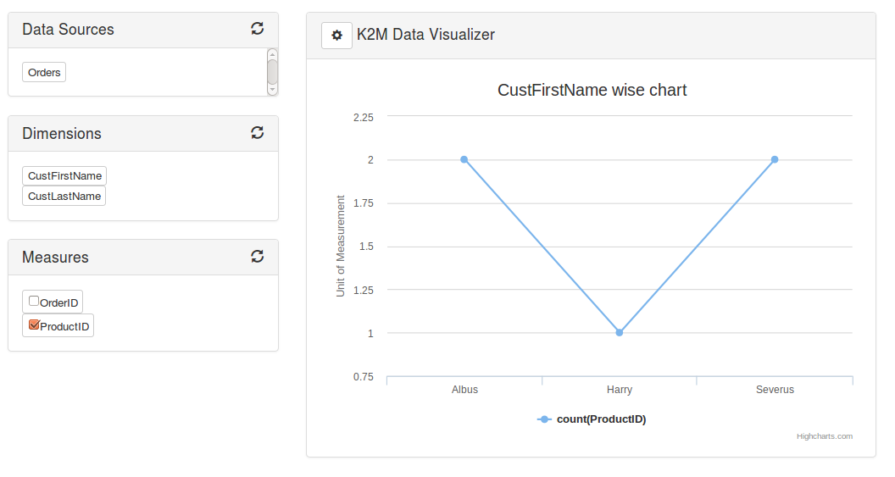

# K2M Source Repository

## This is the github repository for K2M Data Visualization system

## Feature Roadmap

- JDBC/ODBC connection to `MySQL`.
- Drag and Drop Functionality for choosing rows, columns and filters.
- Button to allow user to chose the chart type (pie or column).
- User can choose to display values in tooltip or be visible on the chart (this is already built into Highcharts).
- Ability to Pause/Refresh buttons. Pause chart while building it to avoid qiry execution after every change or adjustment. Refresh the chart once visualisation has been built.
- Ability to export raw data in CSV
- JDBC/ODBC connection to `postgres`.
